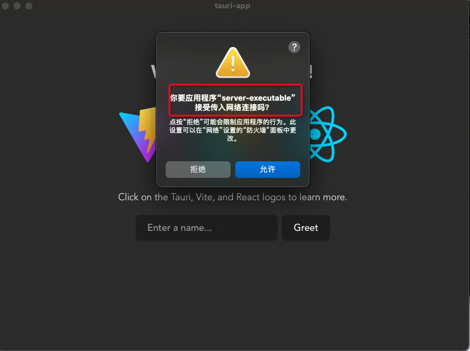
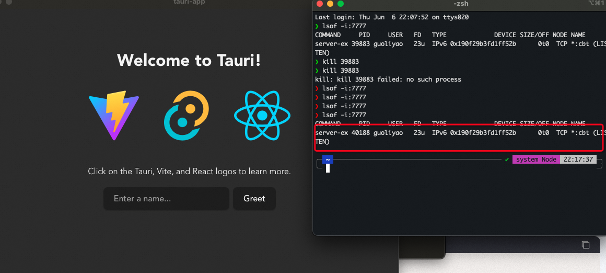

# STEP1 打包 Node.js 环境

```bash
npm install -g pkg

// 在根目录下执行
pkg node-express/server.js --targets node14-macos-x64 --output server-executable
```

会生成 server-executable 可执行文件

# STEP2 将 server-executable 包含到 Tauri 应用的资源中
为了将 server-executable 包含到 Tauri 应用中，您需要在 Tauri 配置文件 tauri.conf.json 中的 tauri > bundle 的 resources 字段中引用它。这会将指定的文件包含到最终的应用包中。
```
"tauri": {
  "bundle": {
    "resources": [
      "../server-executable" // 确保这是您打包的可执行文件相对于项目根目录的路径
    ]
  }
}
```

# STEP3 在 main.rs .setup() 方法中启动可执行文件

```rust
fn main() {
    tauri::Builder::default()
        .invoke_handler(tauri::generate_handler![greet])
        .setup(|app| {
            let resource_dir = app.path_resolver().resolve_resource("../server-executable")
            .unwrap();
  
      
            // 确保路径存在并且是一个文件
            if !resource_dir.exists() || !resource_dir.is_file() {
              Err(format!(
                "无法找到 server-executable。(路径：{:?})",
                resource_dir
              ))?;
            }
      
            // 启动 server-executable
            if let Err(e) = Command::new(resource_dir)
              .spawn()
            {
              Err(format!("Failed to start server-executable: {}", e))?;
            }
      
            // 正确启动 server-executable 后返回 Ok(())
            Ok(())
          })

        .run(tauri::generate_context!())
        .expect("error while running tauri application");
}
```


# 结果
```bash
pnpm tauri build
```
打开dmg 已经运行nodejs 并启动7777端口了


